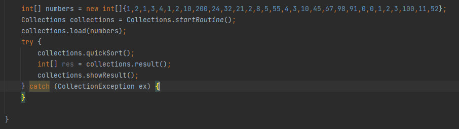

/*
        * Collections API. Java Library for sort and search algorithms.
        * Made by Eduardo Programador.
        * How to use it?
        *
        * 1 - Search Class:
        *   It does not require initialization. Just call it with the two parameters:
        *   Search.find(param1, param2);
        *       param1: An int array list. Eg.: int[] array = new int[]{1,34,2,21,2,0,1,2,0,0,1,8,4,3,2,10};
        *       param2: The value to be search. Eg.: 3
        *       Return value: true if the value is in the list; false, otherwise.
        *
        * 2 - Collections Class:
        *   Instantiate the class:
        *       Collections collections = Collections.startRoutine();
        *   Load an int array:
        *       int[] numbers = new int[]{1,2,1,3,4,1,2,10,200,24,32,21,2,8,5,55,4,3,10,45,67,98,91,0,0,1,2,3,100,11};
        *       collections.load(numbers);
        *  Call the sort method:
        *       collections.quickSort();
        * Read the result as an int array:
        *       int[] res = collections.result();
        *
        * Other methods:
        *       bubbleSort();
        *       selectionSort();
        *       insertionSort();
        *
        *
        *
        *
        *
*/
